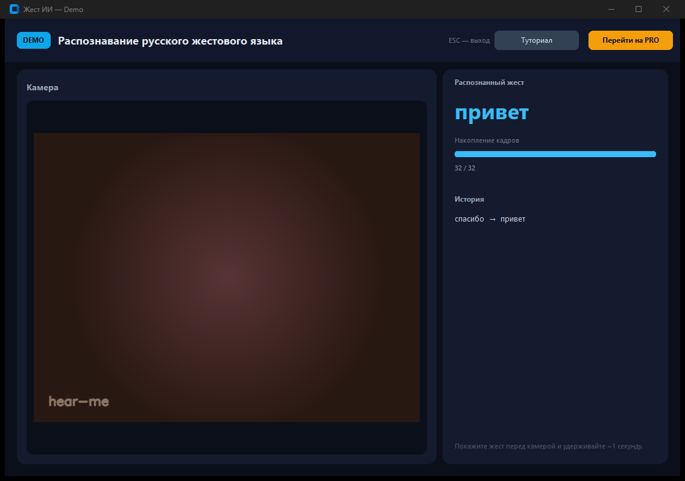
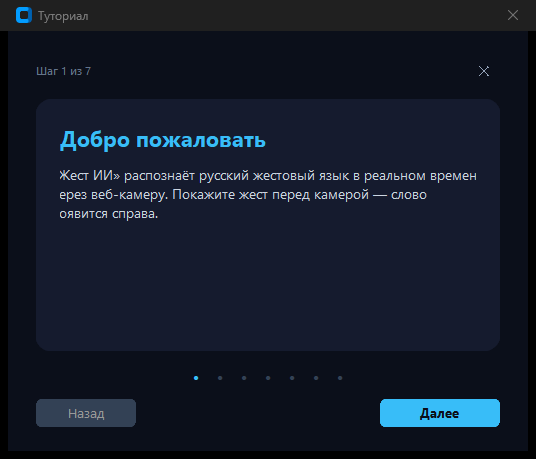
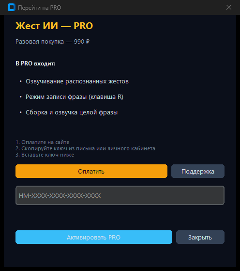
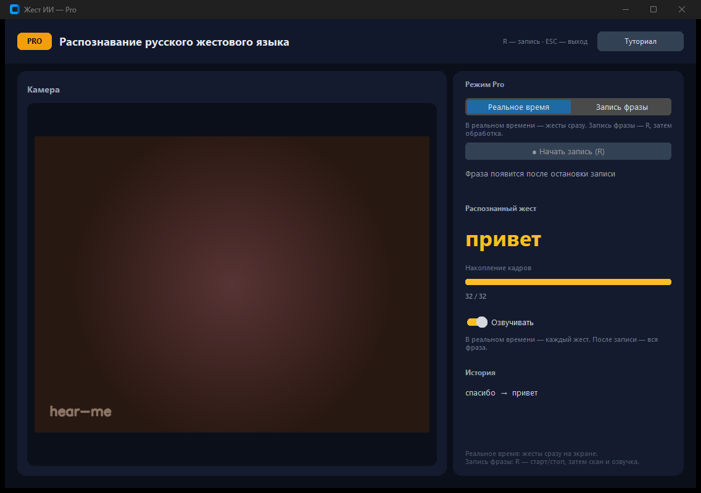
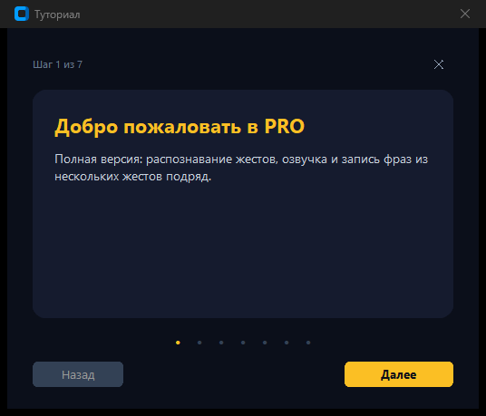
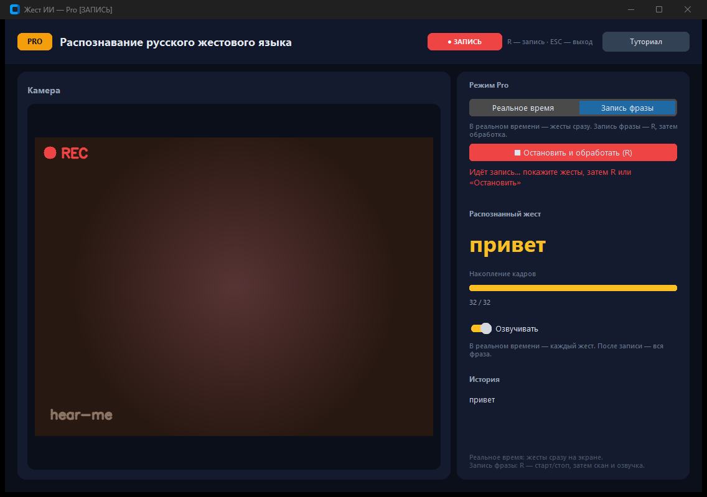

# Жест ИИ (hear-me)

Локальное приложение для **распознавания русского жестового языка** по веб-камере. Работает офлайн: видео обрабатывается на вашем компьютере, в интернет отправляются только действия по оплате PRO (открытие страницы оплаты в браузере).

| Версия | Возможности |
|--------|-------------|
| **Demo** | Распознавание в реальном времени, история жестов, туториал |
| **Pro** | Всё из Demo + озвучка жестов и фраз, запись фразы по клавише **R** |

Подробная техническая документация: [doc/PROJECT_DOCUMENTATION.md](doc/PROJECT_DOCUMENTATION.md).

---

## Требования

- **Windows 10/11** (рекомендуется) или Linux/macOS
- **Python 3.12+**
- Веб-камера
- Файлы модели в корне проекта:
  - `S3D.onnx` — ONNX-модель
  - `RSL_class_list.txt` — словарь классов жестов

---

## Установка

```bash
git clone <url-репозитория> hear-me
cd hear-me

python -m venv .venv
.venv\Scripts\activate          # Windows
# source .venv/bin/activate   # Linux / macOS

pip install -r requirements.txt
```

Убедитесь, что `S3D.onnx` лежит рядом с `main.py` (путь задаётся в `configs/config.json`).

---

## Запуск

```bash
python main.py
```

- без активной лицензии откроется **Demo**;
- с активированным ключом PRO — **Pro**.

Прямой запуск режимов:

```bash
python demo.py   # только Demo
python pro.py    # только Pro (нужна лицензия не обязательна для окна, но для main.py — да)
```

**Горячие клавиши**

| Клавиша | Действие |
|---------|----------|
| `ESC` | Выход |
| `R` | В Pro, режим «Запись фразы»: начать / остановить запись |

---

## Интерфейс Demo

Главное окно: камера слева, распознанный жест и история справа.



1. Разрешите доступ к камере, если система спросит.
2. Держите руки в кадре при **хорошем освещении**.
3. Покажите жест и **удерживайте ~1 секунду** — пока не заполнится полоска «Накопление кадров» (32 кадра).
4. Слово появится крупно справа; последние жесты — в блоке **История**.

Кнопка **«Туториал»** — пошаговая карусель по всем элементам интерфейса:



Кнопка **«Перейти на PRO»** — оплата и активация ключа:



**Шаги активации PRO**

1. Нажмите **«Оплатить»** — откроется сайт из `configs/commerce.json`.
2. Скопируйте ключ формата `HM-XXXX-XXXX-XXXX-XXXX`.
3. Вставьте в поле и нажмите **«Активировать PRO»**.
4. Перезапустите `python main.py` — откроется Pro (или приложение переключится сразу после активации из Demo).

Тестовый ключ для разработки:

```bash
python tools/generate_license.py
```

Лицензия сохраняется в `%APPDATA%\hear-me\license.json` (Windows).

---

## Интерфейс Pro

### Режим «Реальное время»

Каждый удержанный жест сразу показывается справа. При включённом **«Озвучивать»** слово произносится вслух.



### Туториал Pro

Отдельные подсказки по озвучке, записи фразы и горячим клавишам:



### Режим «Запись фразы»

1. Переключите сегмент **«Запись фразы»**.
2. Нажмите **«Начать запись»** или клавишу **R**.
3. Покажите **серию жестов** подряд (каждый удерживайте ~1 с).
4. Снова **R** или **«Остановить и обработать»** — программа соберёт фразу из кадров.
5. Готовая фраза появится в блоке над жестом; при включённой озвучке — прозвучит целиком.



---

## Советы по распознаванию

- Свет спереди или сбоку, без сильной засветки за спиной.
- Однотонный фон помогает модели.
- Не двигайте руки слишком быстро — нужно накопить 32 кадра.
- Если жест не меняется, подождите, пока полоска накопления снова заполнится.

---

## Устранение неполадок

| Проблема | Что сделать |
|----------|-------------|
| `Не удалось открыть веб-камеру` | Закройте другие программы с камерой, проверьте драйвер и разрешения Windows |
| Долго нет слова | Удерживайте жест дольше, улучшите свет, проверьте наличие `S3D.onnx` |
| Ошибка при старте модели | Проверьте `configs/config.json` и пути к `S3D.onnx`, `RSL_class_list.txt` |
| Ключ не принимается | Формат `HM-…`, без лишних пробелов; для продакшена задайте `HEAR_ME_LICENSE_SECRET` |
| Нет озвучки | В Pro включите **«Озвучивать»**; на Windows нужны системные голоса (русский — по возможности) |

---

## Скриншоты для документации

Чтобы переснять картинки в `doc/screenshots/` (заглушка камеры, без ONNX-инференса):

```bash
python tools/capture_readme_screenshots.py
```

Перед каждым кадром скрипт ждёт **3 секунды** — удобно свернуть лишние окна. На Windows захват идёт через **PrintWindow** (содержимое окна, а не произвольный участок экрана).

---

## Структура проекта (кратко)

```
main.py          — вход: Pro при лицензии, иначе Demo
demo.py / pro.py — интерфейс
model.py         — ONNX Runtime
utils.py         — SLInference (очередь кадров)
services/        — TTS, лицензии, туториал, апгрейд
configs/         — config.json, commerce.json
```

---

## Лицензия

См. файл [LICENSE](LICENSE) в репозитории.
